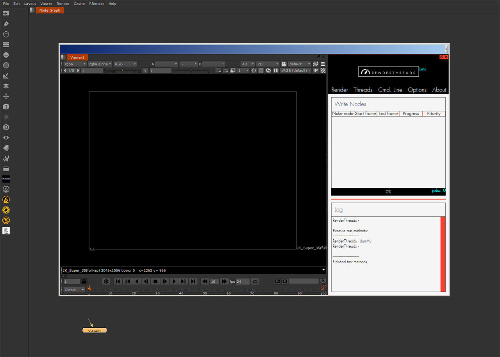

.. _installation:

.. 
    How to install renderthreads.

.. figure:: media/images/general/icn_renderthreads.png
    :width: 100px
    :align: center
    :alt: renderthreads icon
------------------------------------------

Installation
============

The installation is easy. Choose one of several options.

Manual installation
-------------------
------------------------------------------

* Go to `PyPI <https://pypi.python.org/pypi/renderthreads/>`_ and download the package.
* Then extract the zip and go into the folder renderthreads-x.x.x (for example renderthreads-0.2.3). In there you'll find a folder called **renderthreads**.
* Take it and copy it into your Nuke **site-packages** (usually *NukeX.YvZ/lib/site-packages/*) or anywhere else on your Nuke Python path.

pip
---
------------------------------------------

If you have pip installed for your Python interpreter in Nuke you can just type the following:

.. code::

    pip install renderthreads

To verify the installation type:

.. code::

    pip list

and see if renderthreads is amongst the listed packages.

.. note:: 

    In case you have pip but **NOT** for your Nuke Python interpreter, which might often be the case, i would still recommend doing the above procedure.
    **renderthreads** will then be installed into your default system Python and you have to copy it into your Nuke
    site-packages by hand **but** pip still provides an easy and clean way to quickly update **renderthreads**.

Run it
------
------------------------------------------

To start it open up your **Nuke Python script editor**, copy this and run:

.. code::
    
    from renderthreads import renderthreads
    reload(renderthreads)
    renderthreads.run()

In the case of a successful execution you should see the following window:

    You successfully installed renderthreads.