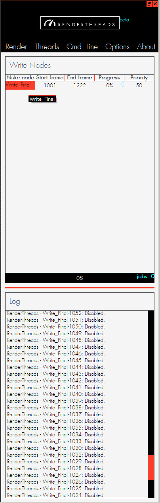
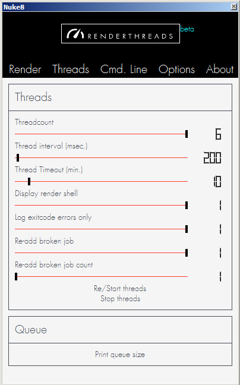
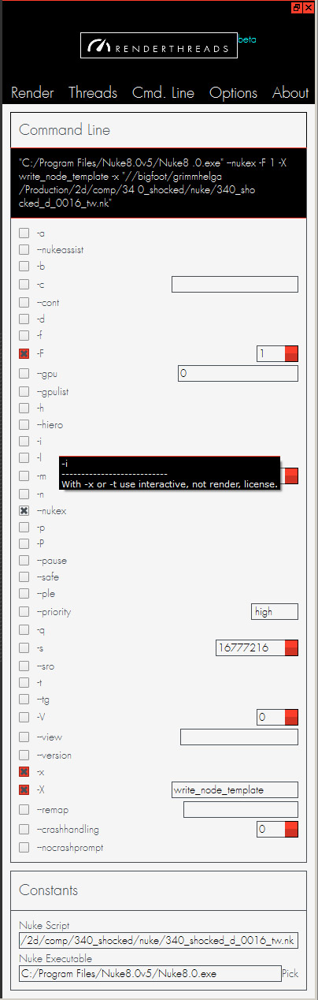
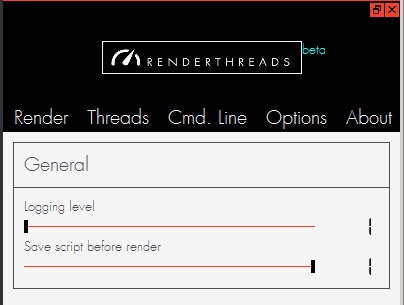

.. _options:

.. 
    Renderthreads options.

.. figure:: media/images/general/icn_renderthreads.png
    :width: 100px
    :align: center
    :alt: renderthreads icon
------------------------------------------

Options
=======

------------------------------------------

**renderthreads** gives you a few menus to adjust things and influence the rendering.
All the widgets provide reasonable **tooltips** that tell you what they are doing. 
Anyways, here's another source of information on what those settings do.

------------------------------------------

Render
------

------------------------------------------

------------------------------------------

* **Nuke node** is the name of the write node you are about to render. You can edit it from within renderthreads. Write nodes within nested groups are also valid.
* **Start frame** of your render sequence. The initial value is taken from the root node.
* **End frame** of your render sequence. The initial value is taken from the root node.
* **Progress** of the rendering of your specific write node. The blue number is the total amount of jobs/frames. The progressbar at the bottom displays the **sum of all write nodes**.
* **Priority** of the rendering of the specific write node. This cannot be adjusted once the jobs are added. In case of equal priorities the jobs are prioritized by the write node alphabetic order.
* **Log** displays success/fail messages for the command-line jobs. By default only error messages are logged, but you can change that in the **Threads** menu.

Threads
-------

------------------------------------------

------------------------------------------

* **Threadcount** lets you adjust how many threads/cores you want to use for rendering. Each core renders a single frame. By default the number of cores is **half the number of the available cores in your system**, which is a conservative setting ment to prevent **memory overflow**.

	.. warning::

		Be aware that each command-line render opens your Nuke script to process it. Therefore it needs a certain amount of memory. When too many jobs are started that eat a lot of memory you might want to pick a lower threadcount to prevent **memory overflow**.

* **Thread interval** is the rate at which a new job is started by a thread after the thread finished the current job. The should rarely be a reason to increase this value.
* **Thread timeout** is a more **important value**. It sets the time in minutes that a rendering is allowed to take before it is forcibly closed. The default is 10 minutes, but demanding nuke comps can easily take longer. **If you wonder why all your renderings are terminated, a too low timeout setting might be the reason.**
* **Display render shell** lets you adjust wether or not you want shell windows popping up.
* **Log exitcode errors only** Wether you just want errors and their exit codes logged (process terminated, timed out, was disabled...) or also sucess messages.
* **Re-add broken job** Wether or not to add a job to the queue again that terminated unsuccessfully. (With an exitcode different from 0).
* **Re-add broken job count** How often such an error job gets added again. The default is 2.
* **Start/Stop threads** Pause rendering. Will finish all currently running jobs and then re/start or stop rendering. All the jobs remain, so this is like a **pause** function.
* **Print queue size** Print complete count of all jobs.

Command-line
------------

------------------------------------------

------------------------------------------

* **Command-line flags** Assemble the Nuke command line used for rendering. Here you have the default command line options (Taken from Nuke 8.05). At the top you see the command line that you assembled. Some values like **-X, -x or -F are locked and cannot be changed. They are handled internally**. Each flag has a tooltip that describes what it does.

	.. warning::

		**renderthreads** does not restrict you in the combination of flags. Therefore you can set flags that are incompatible or make no sense (like enabling proxy mode while forcing full size rendering).

* **Nuke script** is the currently open script. If the value is Root (script not saved yet), you might be prompted to save before rendering starts. The value updates automatically when you save the script. You cannot change this value.
* **Nuke executable** The nuke exe that is used for rendering. You are free to pick the Nuke version you want. **Nuke is always started with the environment of the Nuke that is starting the jobs.**

Options
-------

------------------------------------------

------------------------------------------

* **Logging level** How verbose **renderthreads** tells you about its state.
* **Save script before render** lets you adjust if you want to automatically save before before starting a render. The default is on. **If this is off you might not render the latest adjustments in your comp unless you saved manually**

