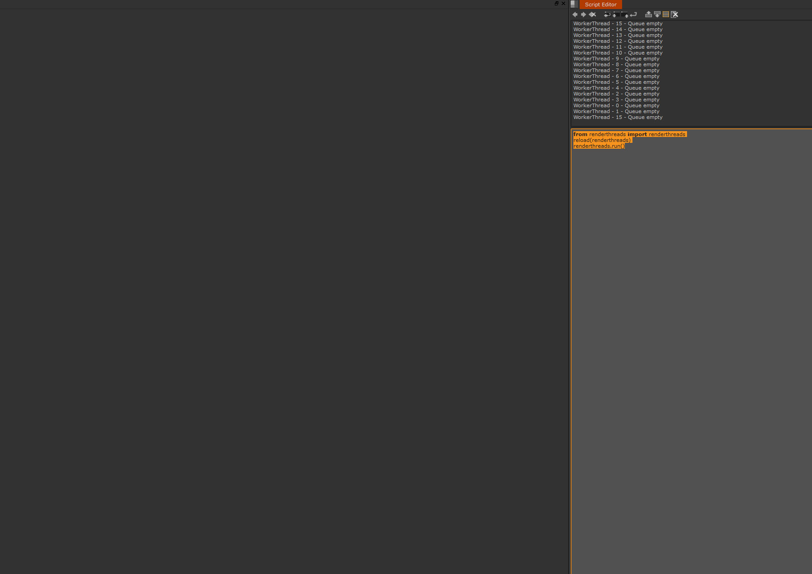
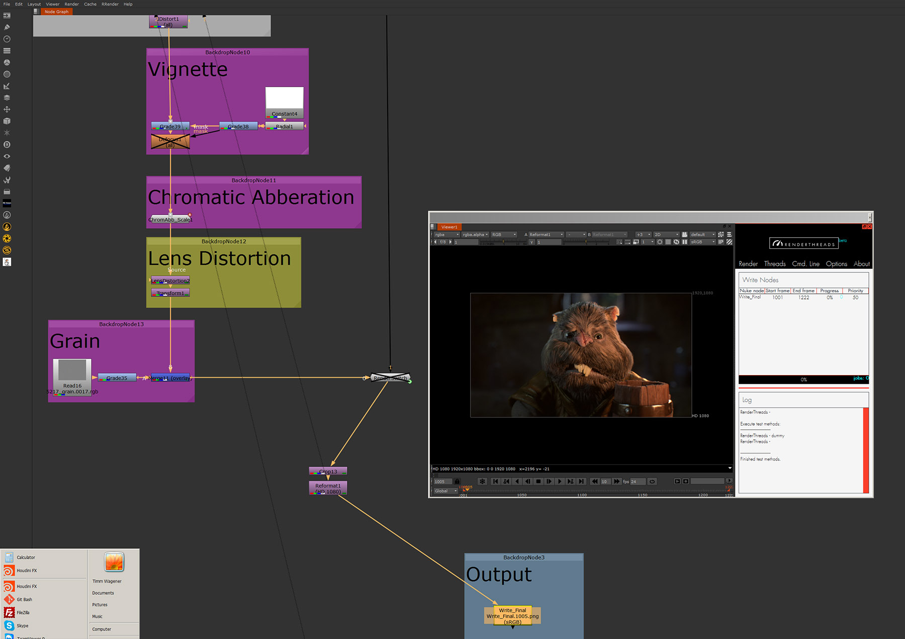
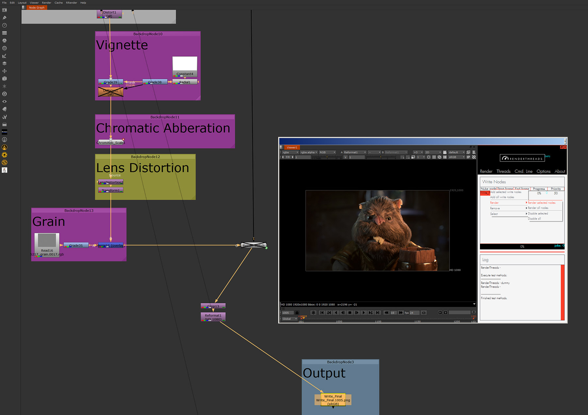
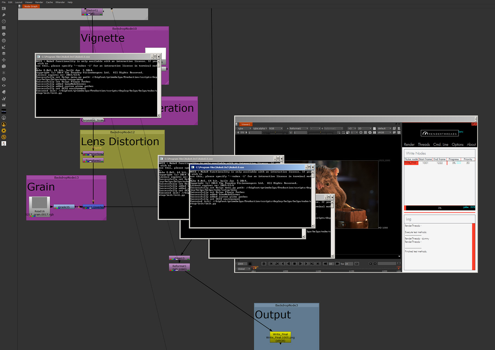

.. _quickstart:

.. 
    Up and running in a minute.

.. figure:: media/images/general/icn_renderthreads.png
    :width: 100px
    :align: center
    :alt: renderthreads icon
------------------------------------------

Quickstart
==========

------------------------------------------

Have your first renderings up and running in under a minute (...or 2).
To start a command-line rendering with **renderthreads** do the following.

------------------------------------------

    Run the startup script like so. You may want to make a button out of it and integrate it in a menu. (Forgot how to install it? :ref:`Here's how <installation>`.)

.. figure:: media/images/quickstart/add_selected_write_nodes.jpg
    :width: 200px
    :align: center
    :alt: renderthreads icon

    Select a write node and add it like so.

    Success. Your Write node is in **renderthreads** along with a **frame range** and a **priority**.

.. figure:: media/images/quickstart/check_the_command_line.jpg
    :width: 200px
    :align: center
    :alt: renderthreads icon

    **Optional:** Check the command line menu if the command line settings are fine. For example you could tell Nuke to use render licenses over interactive ones. Each command line flag has a tooltip to (more or less) explain it. The explanations are copied from *../Nuke.exe -help*

.. figure:: media/images/quickstart/check_script_name_and_nuke_version.jpg
    :width: 200px
    :align: center
    :alt: renderthreads icon

    **Optional:** Check the script name and the Nuke path under **Constants**. The nuke script is always the one you have open right now. If it says **Root** you might be prompted to save before rendering can start. The Nuke version can be choosen.

    Start the rendering like so. By default rendering will happen on half of the cores you have available. (You can adjust the number of cores in the *Threads* menu)

    Success, you are rendering. A lot of command shells pop up by default (No worries, you can disable this in the *Threads* menu). The progress is displayed in the interface.

------------------------------------------

    You can disable the rendering anytime, like so. Disabling will continue to finish the jobs already started, but not begin all the other ones that are still queued.